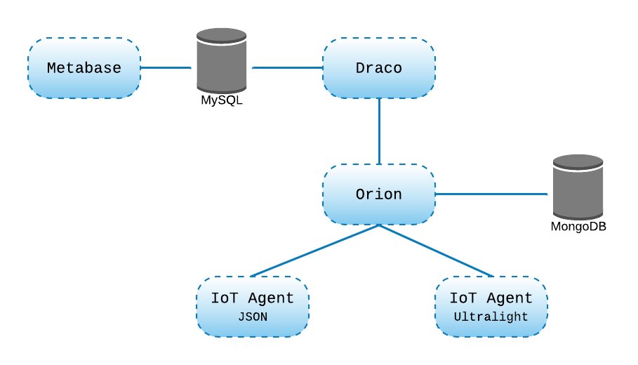

# GEs FIWARE para a plataforma SWAMP

## Utilizando os serviços 

Para utilizar os serviços basta clonar este repositório em seu ambientew de trabalho e uilizar o seguinte comando para iniciar os serviços. 

```bash
docker-compose up -d
```
Com este comando os serviços devem ser iniciados. Ao final da inicialização execute o comando a seguir para a confirmação de que todos os serviços estajam em execução. 


```bash
docker-compose ps
```

A seguinte saída deve ser apresentada. 

```bash
          Name                        Command               State                                        Ports
--------------------------------------------------------------------------------------------------------------------------------------------------
db-mongo                   docker-entrypoint.sh --bin ...   Up       0.0.0.0:27017->27017/tcp
db-mysql                   docker-entrypoint.sh mysqld      Up       0.0.0.0:3306->3306/tcp, 33060/tcp
fiware-draco               ../scripts/start.sh              Up       10000/tcp, 0.0.0.0:5050->5050/tcp, 8080/tcp, 8443/tcp, 0.0.0.0:9090->9090/tcp
fiware-orion               /usr/bin/contextBroker -fg ...   Up       0.0.0.0:1026->1026/tcp
iot-agent-json_1           pm2-runtime bin/iotagent-j ...   Up       0.0.0.0:4041->4041/tcp, 0.0.0.0:7896->7896/tcp
iot-agent-ul_1             pm2-runtime bin/iotagent-u ...   Up       0.0.0.0:4042->4042/tcp, 0.0.0.0:7897->7897/tcp
metabase                   /app/run_metabase.sh             Exit 1
```

## Serviços configurados 

- Orion Context Broker 
- Mongo DB
- Draco
- MySQL
- Metabase 
- IoT-Agent Ultralight
- IoT-Agent JSON


